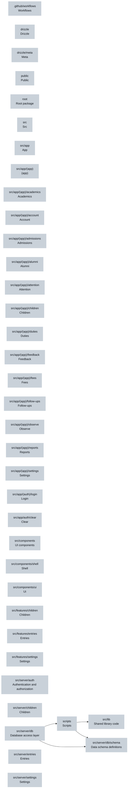

# bala-palana dependency graph

> Generated by [stacklit](https://github.com/glincker/stacklit) on 2026-11-25. Run `stacklit generate` to update.

```mermaid
graph LR
  classDef javascript fill:#c9d1d9,color:#0d1117,stroke:#c9d1d9
  classDef typescript fill:#c9d1d9,color:#0d1117,stroke:#c9d1d9
  github_workflows[".github/workflows<br/>Workflows"]:::typescript
  drizzle["drizzle<br/>Drizzle"]:::typescript
  drizzle_meta["drizzle/meta<br/>Meta"]:::typescript
  public["public<br/>Public"]:::typescript
  root["root<br/>Root package"]:::typescript
  scripts["scripts<br/>Scripts"]:::typescript
  src["src<br/>Src"]:::typescript
  src_app["src/app<br/>App"]:::typescript
  src_app_app["src/app/(app)<br/>(app)"]:::typescript
  src_app_app_academics["src/app/(app)/academics<br/>Academics"]:::typescript
  src_app_app_account["src/app/(app)/account<br/>Account"]:::typescript
  src_app_app_admissions["src/app/(app)/admissions<br/>Admissions"]:::typescript
  src_app_app_alumni["src/app/(app)/alumni<br/>Alumni"]:::typescript
  src_app_app_attention["src/app/(app)/attention<br/>Attention"]:::typescript
  src_app_app_children["src/app/(app)/children<br/>Children"]:::typescript
  src_app_app_duties["src/app/(app)/duties<br/>Duties"]:::typescript
  src_app_app_feedback["src/app/(app)/feedback<br/>Feedback"]:::typescript
  src_app_app_fees["src/app/(app)/fees<br/>Fees"]:::typescript
  src_app_app_follow_ups["src/app/(app)/follow-ups<br/>Follow-ups"]:::typescript
  src_app_app_observe["src/app/(app)/observe<br/>Observe"]:::typescript
  src_app_app_reports["src/app/(app)/reports<br/>Reports"]:::typescript
  src_app_app_settings["src/app/(app)/settings<br/>Settings"]:::typescript
  src_app_auth_login["src/app/(auth)/login<br/>Login"]:::typescript
  src_app_auth_clear["src/app/auth/clear<br/>Clear"]:::typescript
  src_components["src/components<br/>UI components"]:::typescript
  src_components_shell["src/components/shell<br/>Shell"]:::typescript
  src_components_ui["src/components/ui<br/>Ui"]:::typescript
  src_features_children["src/features/children<br/>Children"]:::typescript
  src_features_entries["src/features/entries<br/>Entries"]:::typescript
  src_features_settings["src/features/settings<br/>Settings"]:::typescript
  src_lib["src/lib<br/>Shared library code"]:::typescript
  src_server_auth["src/server/auth<br/>Authentication and authorization"]:::typescript
  src_server_children["src/server/children<br/>Children"]:::typescript
  src_server_db["src/server/db<br/>Database access layer"]:::typescript
  src_server_db_schema["src/server/db/schema<br/>Data schema definitions"]:::typescript
  src_server_entries["src/server/entries<br/>Entries"]:::typescript
  src_server_settings["src/server/settings<br/>Settings"]:::typescript
  scripts --> src_lib
  scripts --> src_server_db_schema
  src_server_db --> scripts
  src_server_db --> src_server_db_schema
```
